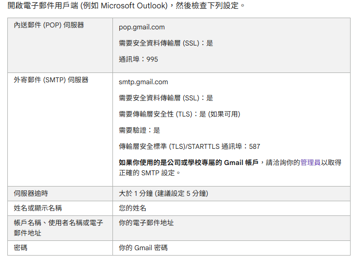

# 郵件服務系統

### 功能

1、都是使用内核功能EmailHelper.cs来发送邮件。

2、使用AppSetting.json 节点配置[SendMailInfo],[GmailInfo] >>> App.cs 需要用到注入服务。

3、使用EmailServiceConfig.json 节点配置[SendMailInfo],[GmailInfo] >>> MailTask.cs 直接new EmailApp(SendMailInfo,GmailInfo)传值给对象。

### 注意问题

1、由于 common 项目等等引用过了的项目中本身存在AppSetting.JSON文件，会由于生成问题同时COPY到主程序中，
导致配置缺失而是 ServiceProvider注入的服务获取为空而导致错误出现。例如发邮件账户null。Not Authorize 等等问题。

2、Program App- OLD1.cs 和 Program App- OLD1B.cs是测试通过注入服务来获取配置的。

3、Program.cs 通过预设配置文件【EmailServiceConfig.json】获取对应配置参数后，传入对象初始化后，运行程序。好处是使用传统技术降低出错风险。目前DataGuardXcore项目的 Register.cs 和ForgotPassword.cs使用就是这个方式。

4、Quartz.AspNetCore V3.2.4

5、MailJobServiceQuartz.CreateDynamicToken(string Scret) 请求端和响应端 密码一致机制是根据【TokenManagement.Scret】来进行HAMC非对称加密的。所以必须确保两端的【TokenManagement.Scret】一致。
也就是MailListApiUrl.HostApiUrl": "http://123.123.132.132" 和MailJobService.exe的Scret配置一致。

EmailServiceConfig.json

### 配置说明

主控台版本需要独立的 EmailServiceConfig.json 配置问题来运行邮件发送服务。

当net core 3.1 web app 时候，把节点配置写入 appsetting.json 中

//谷歌账号会阻止某些不安全的设备或应用登录google账号，需要设置允许，才能正常使用gmail账号发送邮件。
//个人申请的gmaill邮箱，很方便设置。企业邮箱设置位置不太好找

//1、个人邮箱
//登录google账号，直接输入网址
//https://myaccount.google.com/lesssecureapps
//————————————————
//原文链接：https://blog.csdn.net/zdgdq/article/details/78518508  

//如果是IshopX作业任务的情况下, SendMailInfo 的配置是来源于网站,而不会是本地的配置文件.

//注意GOOGLE EMAIL PORT 是 587

【Appsettings.json 节点配置】

  "SendMailInfo": {
    "SenderOfCompany": "126",
    "enableSSL": true,
    "enableTSL": true,
    "enablePasswordAuthentication": true,
    "senderServerHost": "smtp.126.com",
    "senderServerHostPort": 25,
    "senderUserName": "xguard@126.com",
    "fromMailAddress": "xguard@126.com",
    "senderUserPassword": "SAHMIMINZLHDRXSD"
  },
  "GmailInfo": { //ref : https://support.google.com/mail/answer/7104828?authuser=1&hl=zh-Hant&authuser=1&visit_id=637427367852942990-2357665447&rd=1
    "enableSSL": true,
    "enableTSL": true,
    "enablePasswordAuthentication": true,
    "senderServerHost": "smtp.gmail.com",
    "senderServerHostPort": 587,
    "senderMailAddress": "service23761414@gmail.com",
    "senderUserPassword": "Star@23761414"
  },

 https://support.google.com/mail/answer/7104828?authuser=1&hl=zh-Hant&authuser=1&visit_id=637427367852942990-2357665447&rd=1

  [ 如何使用 Gmail SMTP 伺服器發送 SRM 電子郵件？]
  https://kb.synology.com/zh-tw/SRM/tutorial/How_to_use_Gmail_SMTP_server_to_send_emails_for_SRM#x_anchor_id5

  更多發郵件的工具:

  总结下来，可能的推荐有：

1. 使用内置的System.Net.Mail（但注意过时警告，可能不推荐）。

2. 使用MailKit，更现代、高效，支持更多协议。(推荐 *****)

3. 使用SendGrid等第三方服务的NuGet包，如果用户愿意使用云服务。

4. 使用FluentEmail作为更高级的抽象，方便切换和扩展。