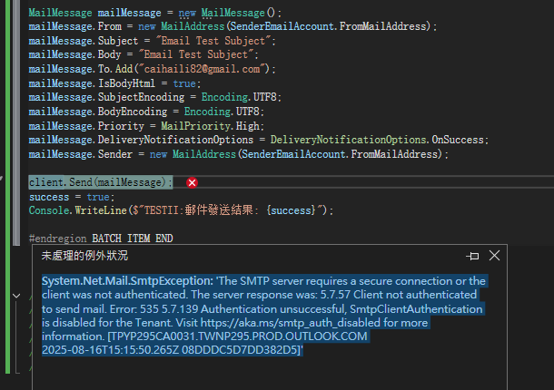
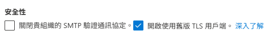

# Mail Enhance Service 郵件增強服務


### 功能

> [!IMPORTANT]
>
> 项目：EamilWebApp.csproj 负责用户界面，Email内容编辑与简单Email发送账号列表.
>
> 项目：MailEnhanceService.csproj 负责邮件服务接口管理和发送任务，为其他包括EamilWebApp, Proj提供邮件发送接口。


## MailEnhanceService

**EmailEnhanceHelper.cs ：** 負責發送，輪詢發佈：如果發送失敗，則選擇發送列表賬號的下一個賬號進行發送。

**Program.cs ：** 負責測試函數，以主控台形式啟動並測試

提供其他項目引用【郵件增強服務】包括後續的 WEB SERVER 擴展功能，允許其他項目以HTTP POST形式，提交EMAIL發送內容和目標EMAIL列表進行發送任務。分定時發送或即時發送。

**WEB SERVER 擴展功能** ：是後續開發的功能，與目前的功能關係是後續開發關係。不影響當前開發和功能。

> [!IMPORTANT]
>
> **目前僅僅是簡化和增強發送成功率，和提供標準配置與發送函數。**


> [!NOTE]
>
> ** 僅使用 AppSetting.json 的 globalConfig 節點的配置。沿用DataGuardXcore項目約定設置。**


## 目標

**替代現有的 MailJobService.csproj**


## 注意问题

 允許簡單的標準化、普通化的模版： MailTemplateEnum 這個常量定義的模版可以直接使用模版，其他需要傳入郵件內容前，先生成內容。

```
public enum MailTemplateEnum
{
    Register = 0,
    ForgetPassword = 1
}
注意配置設置 aspsetting.json 的 senderOfCompany 名稱必須和以下一致
 switch (senderOfCompany)
 {
     case "126.com":
         SendMail126();
         break;
     case "163.com":
         SendMail163();
         break;
     case "qq.com":
         SendMailQQ();
         break;
     case "gmail.com":
         SendMailGoogle();
         break;
     default:
         SendMail();
         break;
 }
```

如果主題信息為空，則從正文內容中提取前20個字符作為主題。


## 標準配置说明

 AppSetting.json 的 senderEmailAccountList 節點的配置, EMAIL發送賬戶列表。默認第1個發送失敗，則用第2個，如此類推。

```
//AppSetting.json
 
 {
  "senderEmailAccountList": [
  	 {
        "senderOfCompany": "126.com", //發郵件at的后面部分 故障排查 465：$ telnet smtp.126.com 587  
        "enableSSL": true,
        "enableTSL": true,
        "enablePasswordAuthentication": true,
        "senderServerHost": "smtp.126.com",
        "senderServerHostPort": 465,
        "senderUserName": "xguard@126.com",
        "fromMailAddress": "xguard@126.com",
        "senderUserPassword": "SAHMIMINZLHDRXSD"
    },
    {
      "senderOfCompany": "xguard.hk",
      "enableSSL": true,
      "enableTSL": true,
      "enablePasswordAuthentication": true,
      "senderServerHost": "smtp.office365.com",
      "senderServerHostPort": 587,
      "senderUserName": "service@xguard.hk",
      "fromMailAddress": "service@xguard.hk",
      "senderUserPassword": "SAHMIMINZLHDRXSD"
    },
   {
     "senderOfCompany": "gmail.com", //發郵件at的后面部分 
     "enableSSL": true,
     "enableTSL": true,
     "enablePasswordAuthentication": true,
     "senderServerHost": "smtp.126.com",
     "senderServerHostPort": 465,
     "senderUserName": "hhguard1@126.com",
     "fromMailAddress": "hhguard1@126.com",
     "senderUserPassword": "SXXXXXXXXXXXXD"
   } 
  ]
}

```

 


## 技術文獻：

  [ 如何使用 Gmail SMTP 伺服器發送 SRM 電子郵件？]
  https://kb.synology.com/zh-tw/SRM/tutorial/How_to_use_Gmail_SMTP_server_to_send_emails_for_SRM#x_anchor_id5

  更多發郵件的工具:

  总结下来，可能的推荐有：

1. 使用内置的System.Net.Mail（但注意过时警告，可能不推荐）。

2. 使用MailKit，更现代、高效，支持更多协议。(推荐 *****)

3. 使用SendGrid等第三方服务的NuGet包，如果用户愿意使用云服务。

4. 使用FluentEmail作为更高级的抽象，方便切换和扩展。


## 郵件服務器故障排除：

```
telnet smtp.126.com 587

Properties props = new Properties();
props.put("mail.smtp.connectiontimeout", "60000"); // 连接超时60秒
props.put("mail.smtp.timeout", "60000");          // 读写超时60秒
props.put("mail.smtp.writetimeout", "60000");     // 写入超时60秒


```

在配置SMTP客户端时，‌**enableSSL属性通常需要设置为启用状态**‌，特别是使用主流邮件服务商(如Gmail、QQ、163等)的SMTP服务时。这是因为现代邮件服务商普遍要求使用SSL/TLS加密来确保邮件传输的安全性。

## 不同邮件服务商的加密要求

根据搜索结果，主流邮件服务商对SMTP加密的要求如下：

| 服务商   | 推荐端口   | 加密方式   | EnableSSL设置      |
| -------- | ---------- | ---------- | ------------------ |
| Gmail    | 465/587    | SSL/TLS    | 必须启用           |
| QQ邮箱   | 465        | SSL        | 必须启用           |
| 163邮箱  | 465/587    | SSL/TLS    | 必须启用           |
| 企业邮箱 | 视配置而定 | 可能不需要 | 根据服务器要求设置 |

# 126邮箱SMTP服务器SSL/TLS配置指南

## 126邮箱SMTP服务器基本配置

126邮箱的SMTP服务器地址为`smtp.126.com`，支持多种端口和加密方式：

- ‌**端口25**‌：默认端口，通常不加密(不推荐使用)
- ‌**端口465**‌：使用SSL加密
- ‌**端口587**‌：使用TLS加密(通过STARTTLS命令)

根据搜索结果，126邮箱官方推荐使用SSL或TLS加密方式发送邮件，以保障邮件传输的安全性4。

## enableSSL和enableTLS是否需要同时启用

‌**不需要同时启用enableSSL和enableTLS**‌，原因如下：

1. ‌**协议互斥性**‌：SSL和TLS是两种不同的加密协议，通常不会同时使用。126邮箱的SMTP服务器会根据端口自动选择加密方式：
   - 端口465：自动使用SSL加密
   - 端口587：自动使用TLS加密(通过STARTTLS命令)46
2. ‌**技术冲突**‌：同时启用两种加密方式可能导致连接失败或协议冲突。大多数邮件客户端和库只支持选择一种加密方式7
3. ‌**126邮箱官方推荐**‌：根据搜索结果，126邮箱推荐根据端口选择对应的加密方式，而不是同时启用两种411

程式碼中，傳入賦值 enableSSL, 如果配置appsetting.json中，如果配置false,則傳入False，可能影響，而 enableTLS 沒有代碼中傳入值。

```
代碼中啟用SSL:  client.EnableSsl = SenderEmailAccount.EnableSSL; 
但是如果代碼運行的機器沒有證書應該是無效的代碼。
```

注意：证书是配置在邮件服务器上的，而不是在你的 C# 代码中。你的代码只需要通过 `EnableSsl = true` 来启用加密连接即可。当客户端（你的程序）连接到配置了有效证书的服务器时，会自动完成 TLS 握手和加密通信。


如果確實需要為已搭建的**郵件伺服器設定證書**，可依下列步驟取得有效證書：

- [ ] **免費證書（推薦個人 / 小型應用程式）**

   - 透過 Let's Encrypt 申請免費 SSL 憑證（有效期 90 天，可自動續約）
   - 申請工具：Certbot（自動化程度高，支援多種伺服器環境）
- [ ] **付費證書（企業級應用程式）**

   - 購買管道：阿里雲、騰訊雲端、華為雲端等雲端服務商的 SSL 憑證服務

   - 類型選擇：通常選擇 "DV SSL"（網域驗證型）即可滿足郵件伺服器需求，價格從每年幾百元到上千元不等

   - 購買流程：在雲端服務商控制台搜尋 "SSL 憑證"，依指引提交網域名稱訊息，驗證通過後即可下載憑證

- [ ] **推荐类型**：DV SSL（域名验证型）或 OV SSL（组织验证型）

  

## Gmail SMTP

**Gmail SMTP服务器正确配置参数**‌：

- 服务器地址：`smtp.gmail.com`45
- 端口：
  - 465 (SSL加密)1011
  - 587 (TLS加密)512

 Gmail SMTP 設置指引 https://support.google.com/mail/answer/7104828?authuser=1&hl=zh-Hant&authuser=1&visit_id=637427367852942990-2357665447&rd=1


## WIN11 個人證書管理器

**certmgr.msc**

## GoDaddy.com操作設置關鍵

在 `xguard.hk` 域名中添加主机记录 `@` 记录值 `MS=ms63800186` 是用来验证您的域名所有权，并确保 Microsoft 365 的服务可以正常使用。

### 具体作用：

1. **域名验证**：这个记录帮助 Microsoft 验证您对该域名的控制权。只有验证通过，您才能使用 Microsoft 365 的相关服务。
2. **确保服务正常**：验证成功后，您可以顺利配置和使用 Microsoft 365 的各种功能，如邮箱、日历等。

### 添加方法：

1. 登录到 GoDaddy 账户。
2. 找到您的域名并进入 DNS 管理界面。
3. 添加一条 TXT 记录：
   - 主机：`@`
   - 值：`MS=ms63800186`
   - TTL：可以选择默认值。

### 验证过程：

1. 添加后，可能需要一些时间才能生效（通常几分钟到48小时）。
2. 在 Microsoft 365 管理中心确认域名的验证状态。

确保完成这些步骤，以便顺利使用 Microsoft 365 的服务。



The SMTP server requires a secure connection or the client was not authenticated. The server response was: 5.7.57 Client not authenticated to send mail. Error: 535 5.7.139 Authentication unsuccessful, SmtpClientAuthentication is disabled for the Tenant. Visit https://aka.ms/smtp_auth_disabled for more information. [SG2PR03CA0110.apcprd03.prod.outlook.com 2025-08-16T16:15:25.016Z 08DDDCC724527082]

https://learn.microsoft.com/zh-hk/exchange/clients-and-mobile-in-exchange-online/authenticated-client-smtp-submission


電腦主機設置：

先安裝Exchange cmd :  $  Install-Module -Name ExchangeOnlineManagement -RequiredVersion 3.0.0 -Force -AllowClobber

Powershell ： $ Set-TransportConfig -SmtpClientAuthenticationDisabled $true




## 設置參考bilibili.com

https://www.bilibili.com/opus/733660627150569523

 

Godaddy.com 自己的郵箱 https://www.godaddy.com/zh-sg/email/professional-business-email


# Gmail.com郵箱服務

測試郵箱服務功能 https://workspace.google.com/intl/zh-HK/products/gmail/

參考設計：

https://www.salescatalysts.com/zh-hk/email-marketing/


# Email.qq.com郵箱服務