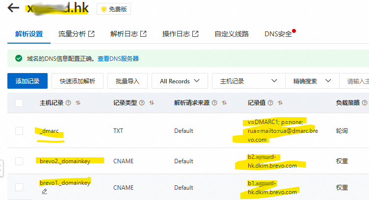

# Mail Enhance Service 郵件增強服務

 https://github.com/tonylaw2008/EmailWebApp.git

### 功能

> [!IMPORTANT]
>
> 项目：EamilWebApp.csproj 负责用户界面，Email内容编辑与简单Email发送账号列表.
>
> 项目：MailEnhanceService.csproj 负责邮件服务接口管理和发送任务，为其他包括EamilWebApp, Proj提供邮件发送接口。


## MailEnhanceService

**EmailEnhanceHelper.cs ：** 負責發送，輪詢發佈：如果發送失敗，則選擇發送列表賬號的下一個賬號進行發送。

**Program.cs ：** 負責測試函數，以主控台形式啟動並測試

提供其他項目引用【郵件增強服務】包括後續的 WEB SERVER 擴展功能，允許其他項目以HTTP POST形式，提交EMAIL發送內容和目標EMAIL列表進行發送任務。分定時發送或即時發送。

**WEB SERVER 擴展功能** ：是後續開發的功能，與目前的功能關係是後續開發關係。不影響當前開發和功能。

> [!IMPORTANT]
>
> **目前僅僅是簡化和增強發送成功率，和提供標準配置與發送函數。**


> [!NOTE]
>
> ** 僅使用 AppSetting.json 的 globalConfig 節點的配置。沿用DataGuardXcore項目約定設置。**


## 目標

**替代現有的 MailJobService.csproj**

提供發郵件服務  

EamilWebApp.csproj : 

	1. 提供email數據庫編輯，標籤管理，按標籤群發郵件功能。
	1. 模版編輯器功能。

## 注意问题

 允許簡單的標準化、普通化的模版： MailTemplateEnum 這個常量定義的模版可以直接使用模版，其他需要傳入郵件內容前，先生成內容。

```
public enum MailTemplateEnum
{
    Register = 0,
    ForgetPassword = 1
}
注意配置設置 aspsetting.json 的 senderOfCompany 名稱必須和以下一致
 switch (senderOfCompany)
 {
     case "126.com":
         SendMail126();
         break;
     case "163.com":
         SendMail163();
         break;
     case "qq.com":
         SendMailQQ();
         break;
     case "gmail.com":
         SendMailGoogle();
         break;
     default:
         SendMail();
         break;
 }
```

如果主題信息為空，則從正文內容中提取前20個字符作為主題。


## 標準配置说明

 AppSetting.json 的 senderEmailAccountList 節點的配置, EMAIL發送賬戶列表。默認第1個發送失敗，則用第2個，如此類推。

```
//AppSetting.json OR SenderEmailAccountList6000014.json
"senderEmailAccountList": [
  {
    "senderOfCompany": "xguard.hk",
    "mailTool": 0, // 0: .Net.Mail, 1: MailKit
    "enableSSL": false, // SSL證書發送，senderServerHostPort=465
    "enableTSL": true,  // TSL 發送，senderServerHostPort=587
    "enablePasswordAuthentication": true,
    "senderServerHost": "smtp-relay.brevo.com",
    "senderServerHostPort": 587,
    "fromMailAddress": "service@xguard.hk",
    "fromMailDisplayName": "Service Center Of Xguard",
    "senderUserName": "955ced001@smtp-brevo.com",
    "senderUserPassword": "B1LEptMgQODdnr2Z",
    "Remarks": "[mailTool:System.Net.Mail.SmtpClient=0; MailKit.Net.Smtp.SmtpClient=1] [StartTLS=587;SSL=465] This is the brevo.com email account used for sending emails from XGuard."
  }
```

 

## EMAIL SMTP工具技術文獻：

  [ 如何使用 Gmail SMTP 伺服器發送 SRM 電子郵件？]
  https://kb.synology.com/zh-tw/SRM/tutorial/How_to_use_Gmail_SMTP_server_to_send_emails_for_SRM#x_anchor_id5

  更多發郵件的工具:

  总结下来，可能的推荐有：

1. 使用内置的System.Net.Mail（功能少，不推荐）。

2. **使用MailKit 4.13.0，更现代、高效，支持更多协议。(推荐 *)**

3. 使用SendGrid等第三方服务的NuGet包，如果用户愿意使用云服务。

4. 使用FluentEmail作为更高级的抽象，方便切换和扩展。


## 郵件服務器故障排除：

```
telnet smtp.126.com 587

Properties props = new Properties();
props.put("mail.smtp.connectiontimeout", "60000"); // 连接超时60秒
props.put("mail.smtp.timeout", "60000");          // 读写超时60秒
props.put("mail.smtp.writetimeout", "60000");     // 写入超时60秒

```

在配置SMTP客户端时，‌**enableSSL属性通常需要设置为启用状态**‌，特别是使用主流邮件服务商(如Gmail、QQ、163等)的SMTP服务时。这是因为现代邮件服务商普遍要求使用SSL/TLS加密来确保邮件传输的安全性。

## 不同邮件服务商的加密要求

根据搜索结果，主流邮件服务商对SMTP加密的要求如下：

| 服务商   | 推荐端口   | 加密方式   | EnableSSL设置      |
| -------- | ---------- | ---------- | ------------------ |
| Gmail    | 465/587    | SSL/TLS    | 必须启用           |
| QQ邮箱   | 465        | SSL        | 必须启用           |
| 163邮箱  | 465/587    | SSL/TLS    | 必须启用           |
| 企业邮箱 | 视配置而定 | 可能不需要 | 根据服务器要求设置 |

# 126邮箱SMTP服务器SSL/TLS配置指南

## 126邮箱SMTP服务器基本配置

126邮箱的SMTP服务器地址为`smtp.126.com`，支持多种端口和加密方式：

- ‌**端口25**‌：默认端口，通常不加密(不推荐使用)
- ‌**端口465**‌：使用SSL加密
- ‌**端口587**‌：使用TLS加密(通过STARTTLS命令)

根据搜索结果，126邮箱官方推荐使用SSL或TLS加密方式发送邮件，以保障邮件传输的安全性4。

## enableSSL和enableTLS是否需要同时启用

‌**不同时启用enableSSL和enableTLS**‌，原因如下：

1. ‌**协议互斥性**‌：SSL和TLS是两种不同的加密协议，通常不会同时使用。126邮箱的SMTP服务器会根据端口自动选择加密方式：
   - 端口465：自动使用SSL加密
   - 端口587：自动使用TLS加密(通过STARTTLS命令)46
2. ‌**技术冲突**‌：同时启用两种加密方式可能导致连接失败或协议冲突。大多数邮件客户端和库只支持选择一种加密方式7
3. ‌**126邮箱官方推荐**‌：根据搜索结果，126邮箱推荐根据端口选择对应的加密方式，而不是同时启用两种411

程式碼中，傳入賦值 enableSSL, 如果配置appsetting.json中，如果配置false,則傳入False，可能影響，而 enableTLS 沒有代碼中傳入值。

```
代碼中啟用SSL:  client.EnableSsl = SenderEmailAccount.EnableSSL; 
但是如果代碼運行的機器沒有證書應該是無效的代碼。
```

注意：证书是配置在邮件服务器上的，而不是在你的 C# 代码中。你的代码只需要通过 `EnableSsl = true` 来启用加密连接即可。当客户端（你的程序）连接到配置了有效证书的服务器时，会自动完成 TLS 握手和加密通信。


如果確實需要為已搭建的**郵件伺服器設定證書**，可依下列步驟取得有效證書：

- [ ] **免費證書（推薦個人 / 小型應用程式）**

   - 透過 Let's Encrypt 申請免費 SSL 憑證（有效期 90 天，可自動續約）
   - 申請工具：Certbot（自動化程度高，支援多種伺服器環境）
- [ ] **付費證書（企業級應用程式）**

   - 購買管道：阿里雲、騰訊雲端、華為雲端等雲端服務商的 SSL 憑證服務

   - 類型選擇：通常選擇 "DV SSL"（網域驗證型）即可滿足郵件伺服器需求，價格從每年幾百元到上千元不等

   - 購買流程：在雲端服務商控制台搜尋 "SSL 憑證"，依指引提交網域名稱訊息，驗證通過後即可下載憑證

- [ ] **推荐类型**：DV SSL（域名验证型）或 OV SSL（组织验证型）

  

## Gmail SMTP

**Gmail SMTP服务器正确配置参数**‌：

 Gmail SMTP 設置指引 https://support.google.com/mail/answer/7104828?authuser=1&hl=zh-Hant&authuser=1&visit_id=637427367852942990-2357665447&rd=1


## WIN11 個人證書管理器

**certmgr.msc** 


# Brevo.com SMTP服务

## 1. https://www.brevo.com/

登录帐号：caXXXXi82@Xmail.com 登记手机号：+8XX-625XX738

https://app.brevo.com/contact/list

開通域名綁定到Brevo.com

https://dnsnext.console.alibabacloud.com/authoritative/domains/xguard.hk
主要是 CName TXT Record Type以及記錄值等等



## 2. Sender : service1@xguard.hk

Sender 發件人可以自定義，免費模式也有幾十個賬號可以自定義。

```
SMTP：serversmtp-relay.brevo.com
Port：587
Login：955ced001@smtp-brevo.com
Password：B1LEptMgQODdnr2Z
```

## 3. API Key：B1LEptMgQODdnr2Z

To configure Postfix, edit the file /etc/postfix/main.cf and add the following code at the end :

```
smtp_sasl_auth_enable = yes
smtp_sasl_password_maps = static:955ced001@smtp-brevo.com:B1LEptMgQODdnr2Z
smtp_sasl_security_options = noanonymous
smtp_tls_security_level = may
header_size_limit = 4096000
relayhost = smtp-relay.brevo.com:587
```

# SSL與TLS區別

> [!IMPORTANT]
>
> - [x] SSL 默認PORT465 
> - [x] TLS 默認PORT 587  
> - [x] POP3：标准端口110，SSL端口995
> - [x] IMAP：标准端口143，SSL端口993

SSL、TLS、SSL/TLS以及HTTPS之间的关系总结如下：

- **SSL與TLS：**TLS是SSL的升級版，二者功能相似，但TLS更新、更安全且持續更新，「SSL」一詞常被泛用於指稱SSL/TLS整體。
- **HTTPS與SSL/TLS：**HTTPS依賴SSL/TLS實現加密和身份驗證，是 “HTTP的安全增強版”。

他們之間的關係可以用一個公式來概括：**HTTPS=HTTP+SSL/TLS**

不能同時使用兩種加密協議： TLS/SSL

|      | 名稱       | 值                                                           | 類型                                   |
| ---- | ---------- | ------------------------------------------------------------ | -------------------------------------- |
| ◢    | $exception | {"An error occurred while attempting to establish an SSL or TLS connection.\r\n\r\nWhen connecting to an SMTP service, port 587 is typically reserved for plain-text connections. If\r\nyou intended to connect to SMTP on the SSL port, try connecting to port 465 instead. Otherwise,\r\nif you intended to use STARTTLS, make sure to use the following code:\r\n\r\nclient.Connect (\"smtp-relay.brevo.com\", 587, SecureSocketOptions.StartTls);\r\n"} | MailKit.Security.SslHandshakeException |
|      |            | 嘗試建立 SSL 或 TLS 連線時發生錯誤。<br/><br/>連接到 SMTP 服務時，連接埠 587 通常保留用於純文字連線。如果您打算透過 SSL 連接埠連線至 SMTP，請嘗試連線至連接埠 465。否則，<br/><br/>如果您打算使用 STARTTLS，請務必使用以下代碼：<br/><br/>client.Connect ("smtp-relay.brevo.com", 587, SecureSocketOptions.StartTls); |                                        |

为了正确配置 MailKit 的 SSL/TLS 模式，建议遵循以下步骤：

| 邮件服务器类型           | 推荐使用的 SslSecureSocketOptions 枚举值 | 说明                                                |
| :----------------------- | :--------------------------------------- | :-------------------------------------------------- |
| Gmail                    | `Tls12OnConnect`                         | 使用端口 465，要求 TLS 1.2                          |
| Office 365 / Outlook.com | `Tls12OnConnect`                         | 使用端口 587，支持 STARTTLS，但建议直接使用 TLS 1.2 |
| QQ 邮箱                  | `Tls12OnConnect`                         | 通常使用端口 465 或 587，支持现代 TLS 协议          |
| 企业内部 SMTP 服务器     | `StartTls` 或 `TlsOnConnect`             | 需查看服务器文档确认支持的协议版本                  |

https://ithelp.ithome.com.tw/articles/10369379


SSL 證書與非證書區別  TLS加密的都是最簡單的發送方式，要么拒絕（如gmail）,要么標準為危險，不安全。


# 如何引用

複製 MailEnhanceService.dll 到目標項目。

其他Package 先從目標項目安裝：如MailKit 組件安裝到目標項目去。

使用配置工具配置發郵件賬號列表

SenderEmailAccountList_6000014.Json
